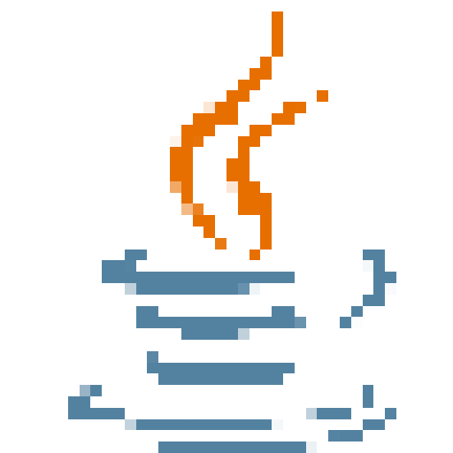
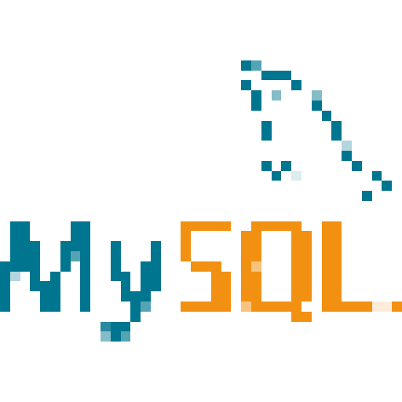
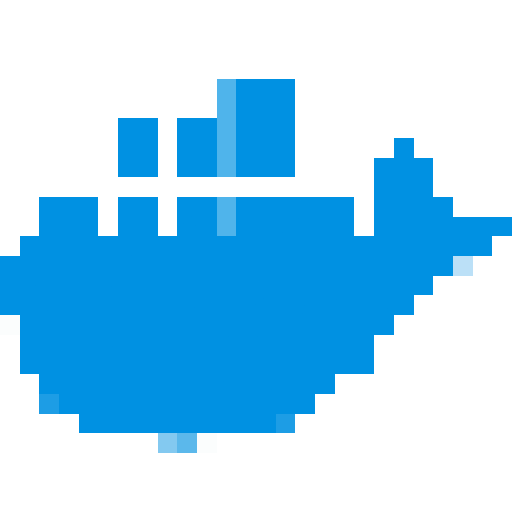

<table>
  <tr>
    <td align="center">
       
      <a href="https://github.com/NotDari/Retro-Github-Stats">[NotDari/Retro-Github-Stats]</a>
    </td>
  </tr>
</table>

## Hi there I'm Dariush 👋

I am a computer science student at the University of Exeter. I have completed many projects both as assigned work and independently. Personal projects include making two apps, one full-stack with a Spring Boot backend and Java frontend, multiple plugins, and other smaller projects. 
Please check out my work below!

The stats and contribution GIFS update each day at midnight.

### Contact

  
  
  

### Languages & Tech Stack

  
  
  
  
  
  
  
  
  
  
  
  
  
  

## Stats: 
<table>
  <tr>
    <td align="center">
      
      <a href="https://github.com/NotDari/Retro-Github-Stats">[NotDari/Retro-Github-Stats]</a>
    </td>
    <td align="center">
      
      <a href="https://github.com/NotDari/Retro-Github-Stats">[NotDari/Retro-Github-Stats]</a>
    </td>
  </tr>
</table>

