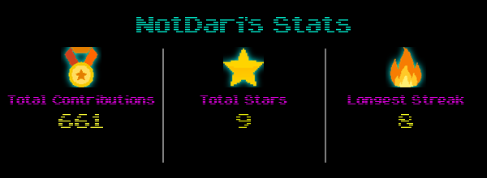
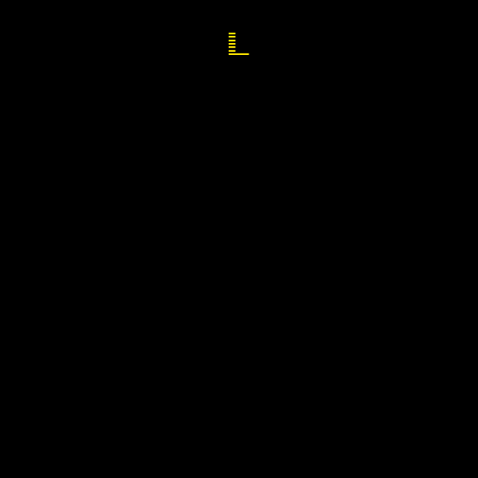

## Hi there I'm Dariush 👋

  I am a computer science science student at the University of Exeter. I have completed many projects both as assigned work and in my free time. Personal projects include making two apps, one full-stack with a springboot backend and java frontend. 
  Please check out my work!

## Contributions: 

## Stats: 

   
   

<!--
**NotDari/NotDari** is a ✨ _special_ ✨ repository because its `README.md` (this file) appears on your GitHub profile.

Here are some ideas to get you started:

- 🔭 I’m currently working on ...
- 🌱 I’m currently learning ...
- 👯 I’m looking to collaborate on ...
- 🤔 I’m looking for help with ...
- 💬 Ask me about ...
- 📫 How to reach me: ...
- 😄 Pronouns: ...
- ⚡ Fun fact: ...
-->
